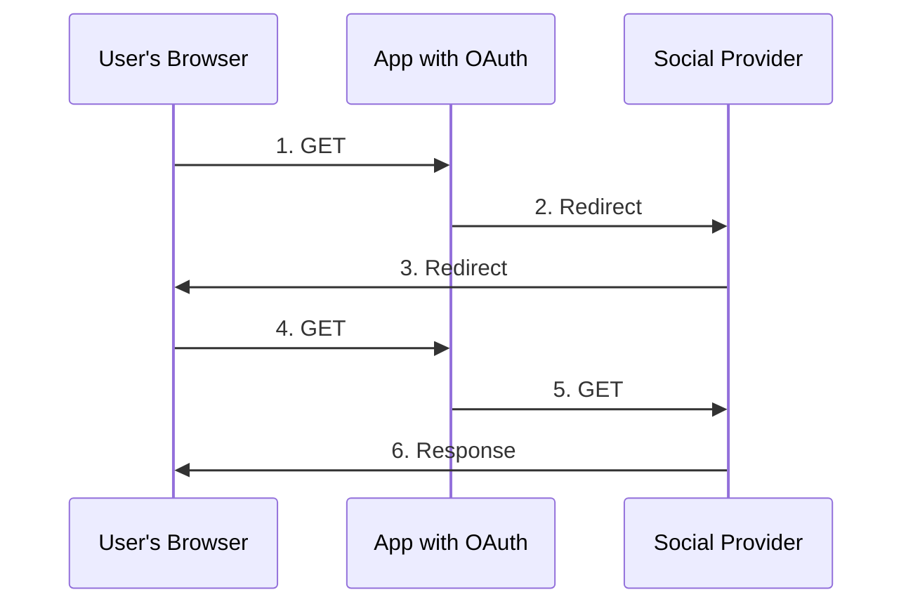

# Express 4.x with Passport

This example demonstrates how to use [Express](http://expressjs.com/) 4.x and [Passport](http://passportjs.org/) to authenticate users using a username and password with [form-based authentication](https://en.wikipedia.org/wiki/HTTP%2BHTML_form-based_authentication) and [JWT](https://jwt.io/) for APIs.

Use this example as a starting point for your own apps.

### Install

```bash
npm install
```

### Start the server

```bash
npm start
```

Open a web browser and navigate to [http://localhost:3000/](http://127.0.0.1:3000/) to see the example in action.  Log in using username `jack` and password `secret`.

### JWT tests

```bash
# Generate valid token for 30s
curl -v -d username=jack -d password=secret http://localhost:3000/api/login
## Success response: {"token": "mytoken"}
## Fail response: {"error":{"message":"Invalid password"}}
```

```bash
# GET user profile if valid token
curl -v -H 'Authorization: Bearer mytoken' http://localhost:3000/api/profile
## Success response: {"user":{"id":1,"username":"jack","password":"secret","displayName":"Jack","emails":[{"value":"jack@example.com"}]}}
## Fail response: {"error":{"message":"..."}}
```

## How works?


>1. Click in the login provider button
>2. Send to login URL page
>3. User accepts dialog and sent to redirect URL with the authorization
>4. Redirect URL with the code
>5. OAuth authorize
>6. Access token
